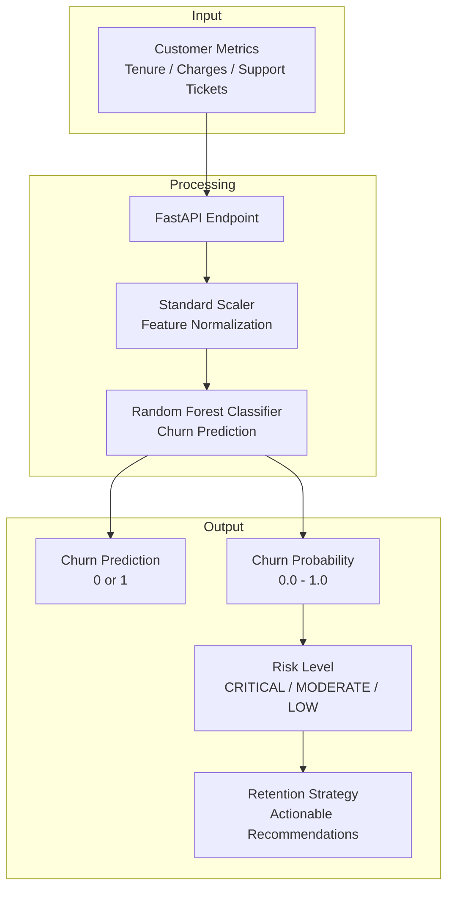

# Customer Churn Analytics API

[](https://www.python.org/downloads/)
[](https://fastapi.tiangolo.com/)
[](https://scikit-learn.org/)
[](https://docs.pytest.org/)
[](https://www.docker.com/)
[](https://github.com/psf/black)

---

## 📋 Table of Contents

- [Overview](#overview)
- [Use Cases](#use-cases)
- [Architecture](#architecture)
- [Key Features](#key-features)
- [Technology Stack](#technology-stack)
- [Project Structure](#project-structure)
- [Getting Started](#getting-started)
  - [Prerequisites](#prerequisites)
  - [Installation](#installation)
  - [Running the Application](#running-the-application)
- [Docker Deployment](#docker-deployment)
- [API Reference](#api-reference)
- [Testing](#testing)
- [Configuration](#configuration)
- [Technical Decisions](#technical-decisions)
- [Roadmap](#roadmap)
- [Contributing](#contributing)

---

## 📖 Overview

A **production-grade machine learning microservice** for predicting customer churn risk and prescribing automated retention strategies based on account tenure, monthly charges, and support friction metrics.

This service enables businesses to:

- **Proactively identify** customers at risk of churning.
- **Automate retention workflows** by integrating predictions with CRM systems.
- **Reduce churn rates** through targeted, data‑driven interventions.
- **Operationalize ML** without the complexity of MLOps platforms.

---

## 🎯 Use Cases

- **SaaS & Subscription Services**: Predict cancellation risk for monthly/annual subscribers.
- **Telecommunications**: Identify mobile or broadband customers likely to switch providers.
- **E‑Commerce**: Detect loyalty program members with declining engagement.
- **Financial Services**: Flag banking or insurance customers with reduced activity.
- **CRM Integration**: Feed churn scores into Salesforce, HubSpot, or Zendesk for automated workflows.

---

## 🏗️ Architecture



### Data Flow

| Stage | Component | Description |
|-------|-----------|-------------|
| **Ingestion** | FastAPI Endpoint | Accepts customer metrics as JSON payload. |
| **Normalization** | Standard Scaler | Standardizes input features for model compatibility. |
| **Inference** | Random Forest Classifier | Predicts churn probability (0–1). |
| **Risk Triage** | Business Logic | Maps probability to risk tiers (CRITICAL, MODERATE, LOW). |
| **Strategy Generation** | Rule Engine | Prescribes retention actions based on risk tier. |
| **Response** | Structured JSON | Returns prediction, probability, risk level, and strategy. |

---

## ⚡ Key Features

- **🤖 Machine Learning Inference**  
  Serves predictions using a `scikit-learn` `Pipeline` (StandardScaler + RandomForestClassifier) serialized with `joblib`.

- **📊 Automated Risk Triage**  
  Categorizes customers into `CRITICAL`, `MODERATE`, or `LOW` risk tiers based on configurable probability thresholds.

- **📝 Prescriptive Retention**  
  Recommends specific action items (discounts, surveys, engagement calls) mapped to each risk tier.

- **🐳 Containerized & Tested**  
  Docker Compose setup with a complete `pytest` validation suite for reliability.

- **⚡ Low‑Latency Inference**  
  Lightweight model (< 10 MB) ensures sub‑100ms response times under load.

---

## 🛠️ Technology Stack

| Category | Technology | Version |
|----------|------------|---------|
| **Language** | Python | 3.11+ |
| **Web Framework** | FastAPI | 0.110+ |
| **ML Libraries** | Scikit-Learn, Pandas, NumPy | 1.4+ |
| **Model Serialization** | Joblib | 1.3+ |
| **Data Validation** | Pydantic | 2.0+ |
| **Testing** | Pytest, HTTPX | 7.0+ |
| **Containerization** | Docker, Docker Compose | - |
| **Code Quality** | Black, isort, Flake8 | - |

---

## 📁 Project Structure

```plaintext
customer-churn-api/
│
├── app/
│   ├── __init__.py
│   ├── main.py                 # FastAPI application entry point
│   │
│   ├── api/
│   │   ├── __init__.py
│   │   └── endpoints.py        # REST API route definitions
│   │
│   ├── core/
│   │   ├── __init__.py
│   │   └── config.py           # Configuration settings
│   │
│   ├── models/
│   │   ├── __init__.py
│   │   └── schemas.py          # Pydantic request/response models
│   │
│   ├── ml/
│   │   ├── __init__.py
│   │   ├── train.py            # Model training script
│   │   ├── predict.py          # Inference wrapper
│   │   └── pipeline.pkl        # Serialized model pipeline
│   │
│   └── services/
│       ├── __init__.py
│       └── strategy.py         # Risk triage & retention strategy generation
│
├── tests/
│   ├── __init__.py
│   ├── test_predict.py         # Inference tests
│   ├── test_strategy.py        # Risk & strategy logic tests
│   └── test_api.py             # API integration tests
│
├── data/
│   └── churn_data.csv          # Dataset for training
│
├── docker/
│   └── Dockerfile
├── docker-compose.yml
├── .env.example                # Environment variables template
├── .gitignore
├── requirements.txt
├── pyproject.toml              # Black/isort configuration
└── README.md
```

---

## 🚀 Getting Started

### Prerequisites

- **Python** 3.11 or higher
- **pip** (Python package manager)
- **Git** (for cloning)

### Installation

1. **Clone the repository**

   ```bash
   git clone https://github.com/your-username/customer-churn-api.git
   cd customer-churn-api
   ```

2. **Create and activate a virtual environment**

   ```bash
   python -m venv venv
   ```

   **Windows (PowerShell):**
   ```powershell
   .\venv\Scripts\Activate.ps1
   ```

   **macOS / Linux:**
   ```bash
   source venv/bin/activate
   ```

3. **Install dependencies**

   ```bash
   pip install --upgrade pip
   pip install -r requirements.txt
   ```

4. **Train the model**

   ```bash
   python -m app.ml.train
   ```

   This will generate `app/ml/pipeline.pkl` using the dataset in `data/churn_data.csv`.

5. **(Optional) Configure environment**

   ```bash
   cp .env.example .env
   ```

### Running the Application

Start the server:

```bash
python -m uvicorn app.main:app --reload --host 0.0.0.0 --port 8000
```

Interactive API documentation (Swagger UI):  
👉 [http://127.0.0.1:8000/docs](http://127.0.0.1:8000/docs)

---

## 🐳 Docker Deployment

```bash
# Build and run with Docker Compose
docker compose up --build

# Run in detached mode
docker compose up --build -d

# Check logs
docker compose logs -f
```

---

## 📚 API Reference

### `POST /api/v1/churn/predict`

**Description**: Predicts churn risk based on customer account metrics and returns a structured risk assessment with a retention strategy.

**Endpoint**: `POST /api/v1/churn/predict`

**Request Body** (`application/json`):

| Parameter | Type | Required | Description |
|-----------|------|----------|-------------|
| `tenure_months` | integer | Yes | Number of months the customer has been active |
| `monthly_charges` | float | Yes | Monthly subscription/recurring charges ($) |
| `total_charges` | float | Yes | Total amount charged to date ($) |
| `support_tickets` | integer | Yes | Number of support tickets raised in the last 6 months |

**Example Request (cURL)**:

```bash
curl -X POST http://localhost:8000/api/v1/churn/predict \
  -H "Content-Type: application/json" \
  -d '{
    "tenure_months": 2,
    "monthly_charges": 115.0,
    "total_charges": 230.0,
    "support_tickets": 7
  }'
```

**Success Response (200)**:

```json
{
  "churn_prediction": 1,
  "churn_probability": 0.8425,
  "risk_level": "CRITICAL",
  "retention_strategy": "Trigger priority outbound retention call and offer 20% renewal discount."
}
```

**Risk Tier Mapping**:

| Probability Range | Risk Level | Strategy Example |
|-------------------|------------|------------------|
| ≥ 0.65 | **CRITICAL** | Priority retention call + 20% discount |
| 0.35 – 0.65 | **MODERATE** | Email survey + loyalty program reminder |
| < 0.35 | **LOW** | Nurture campaign with product updates |

**Error Response (422)**:

```json
{
  "detail": [
    {
      "type": "float_type",
      "loc": ["body", "monthly_charges"],
      "msg": "Input should be a valid number",
      "input": "invalid"
    }
  ]
}
```

---

## 🧪 Testing

Run the full test suite:

```bash
python -m pytest -v
```

**Coverage includes**:
- Model inference correctness (against training‑time outputs).
- Risk triage logic and threshold boundaries.
- Retention strategy generation for all risk tiers.
- API endpoint validation and error handling.

---

## ⚙️ Configuration

Environment variables (loaded from `.env`):

| Variable | Description | Default |
|----------|-------------|---------|
| `RISK_CRITICAL_THRESHOLD` | Probability threshold for CRITICAL tier | `0.65` |
| `RISK_MODERATE_THRESHOLD` | Probability threshold for MODERATE tier | `0.35` |
| `MODEL_PATH` | Path to serialized model pipeline | `./app/ml/pipeline.pkl` |
| `LOG_LEVEL` | Logging verbosity | `INFO` |
| `MAX_REQUEST_SIZE` | Maximum payload size (MB) | `10` |

---

## 🧠 Technical Decisions

1. **Random Forest Over Deep Learning**  
   Random Forest provides a strong baseline with interpretability, low inference latency, and no need for GPUs — ideal for a microservice.

2. **Pipeline Serialization with Joblib**  
   `joblib` is optimized for large NumPy arrays, making model loading faster than `pickle`.

3. **Stateless Inference**  
   The API is stateless, allowing easy horizontal scaling via container orchestration (Kubernetes, ECS).

4. **Rule‑Based Strategy Engine**  
   Instead of training a separate model for retention strategies, rules were coded for clarity and tunability. This allows business teams to adjust strategies without retraining.

---

## 🗺️ Roadmap

- [ ] Add **feature importance** endpoint (SHAP/LIME explanations).
- [ ] Support **batch prediction** (CSV/JSON array uploads).
- [ ] Integrate **retention strategy optimization** via reinforcement learning.
- [ ] Add **real‑time monitoring** with Prometheus metrics.
- [ ] Implement **A/B testing** for strategy effectiveness.
- [ ] Support **multiple model versions** (model registry).

---

## 🤝 Contributing

Contributions are welcome! Please follow these steps:

1. Fork the repository.
2. Create a feature branch (`git checkout -b feature/amazing-feature`).
3. Commit your changes (`git commit -m 'Add amazing feature'`).
4. Push to the branch (`git push origin feature/amazing-feature`).
5. Open a Pull Request.

### Development Guidelines

- Follow **PEP 8** style guidelines.
- Write **docstrings** for all functions and classes.
- Add **unit tests** for new functionality.
- Ensure all tests pass before submitting a PR.

---

<p align="center">
  Made with ❤️ and 🐍 Python
</p>

<p align="center">
  ⭐ Star this repository if you find it useful!
</p>
