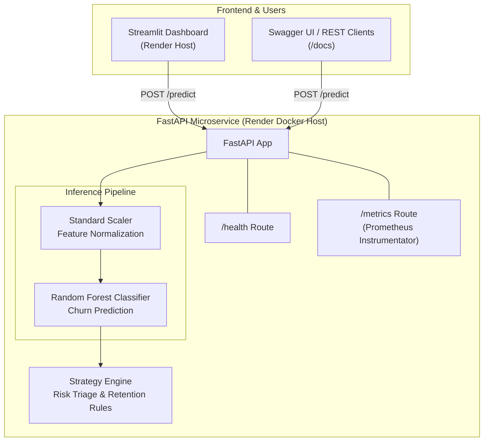

# Customer Churn Analytics API


---

## 🌐 Live Production Deployments

- **📊 Interactive UI Dashboard**: [https://customer-churn-dashboard.onrender.com](https://customer-churn-dashboard.onrender.com)
- **⚡ REST API Documentation (Swagger UI)**: [https://customer-churn-api-ahwc.onrender.com/docs](https://customer-churn-api-ahwc.onrender.com/docs)
- **💚 API Health Check**: [https://customer-churn-api-ahwc.onrender.com/api/v1/churn/health](https://customer-churn-api-ahwc.onrender.com/api/v1/churn/health)

---

## 📋 Table of Contents

- [Overview](#overview)
- [Use Cases](#use-cases)
- [Architecture](#architecture)
- [Key Features](#key-features)
- [Technology Stack](#technology-stack)
- [Project Structure](#project-structure)
- [Getting Started](#getting-started)
  - [Prerequisites](#prerequisites)
  - [Installation](#installation)
  - [Running the Application](#running-the-application)
- [Interactive Dashboard](#interactive-dashboard)
- [Load Testing & Benchmarks](#load-testing--benchmarks)
- [Docker & Cloud Deployment](#docker--cloud-deployment)
- [API Reference](#api-reference)
- [Testing & Quality Checks](#testing--quality-checks)
- [Configuration](#configuration)
- [Technical Decisions](#technical-decisions)
- [Roadmap](#roadmap)
- [Contributing](#contributing)

---

## 📖 Overview

A **production-grade machine learning microservice** for predicting customer churn risk and prescribing automated retention strategies based on account tenure, monthly charges, and support friction metrics.

This service enables businesses to:

- **Proactively identify** customers at risk of churning.
- **Automate retention workflows** by integrating predictions into CRM systems.
- **Reduce churn rates** through targeted, data-driven interventions.
- **Operationalize ML** with automated logging, testing, telemetry, formatting, and load benchmarks.

---

## 🎯 Use Cases

- **SaaS & Subscription Services**: Forecast cancellation risk for monthly/annual subscribers.
- **Telecommunications**: Identify mobile or broadband customers likely to switch providers.
- **E-Commerce**: Detect loyalty program members with declining engagement.
- **Financial Services**: Flag banking or insurance customers with reduced activity.
- **CRM Integration**: Feed churn scores into platforms like Salesforce, HubSpot, or Zendesk to trigger automated retention workflows.

---

## 🏗️ Architecture



### Data Flow

| Stage | Component | Description |
| --- | --- | --- |
| **Ingestion** | FastAPI Endpoint | Accepts customer metrics as a JSON payload. |
| **Normalization** | Standard Scaler | Standardizes input features for model compatibility. |
| **Inference** | Random Forest Classifier | Predicts churn probability (0–1). |
| **Risk Triage** | Business Logic | Maps probability to risk tiers (CRITICAL, MODERATE, LOW). |
| **Strategy Generation** | Rule Engine | Prescribes retention actions based on risk tier. |
| **Response** | Structured JSON | Returns prediction, probability, risk level, and strategy. |

---

## ⚡ Key Features

* **🤖 Machine Learning Inference**
Serves predictions using a `scikit-learn` `Pipeline` (StandardScaler + RandomForestClassifier) serialized with `joblib`.
* **📊 Automated Risk Triage**
Categorizes customers into `CRITICAL`, `MODERATE`, or `LOW` risk tiers based on configurable probability thresholds.
* **📝 Prescriptive Retention**
Recommends specific action items (discounts, surveys, engagement calls) mapped to each risk tier.
* **🖥️ Interactive UI Dashboard**
Includes a Streamlit web app hosted live for real-time risk triage and parameter simulation.
* **📈 Load Tested Performance**
Locust benchmarking framework configured for concurrency and throughput evaluation against live or local hosts.
* **🐳 Containerized & Cloud Ready**
Multi-container Docker Compose setup with `pytest` (92% coverage), `pre-commit` hooks, and automated Render production deployments via GitHub Actions.

---

## 🛠️ Technology Stack

| Category | Technology | Version |
| --- | --- | --- |
| **Language** | Python | 3.11+ |
| **Web Framework** | FastAPI, Uvicorn | 0.110+ |
| **Frontend UI** | Streamlit | 1.32+ |
| **ML Libraries** | Scikit-Learn, Pandas, NumPy | 1.4+ |
| **Model Serialization** | Joblib | 1.3+ |
| **Data Validation** | Pydantic | 2.6+ |
| **Telemetry** | Prometheus Instrumentator | 7.0+ |
| **Testing & Coverage** | Pytest, Pytest-Cov, HTTPX | 8.1+ |
| **Load Testing** | Locust | 2.24+ |
| **Code Quality** | Black, Isort, Pre-Commit | - |
| **Containerization & Hosting** | Docker, Docker Compose, Render | - |
| **CI/CD** | GitHub Actions | - |

---

## 📁 Project Structure

```text
customer-churn-analytics/
├── .github/
│   └── workflows/
│       └── ci.yml              # GitHub Actions CI pipeline
├── app/
│   ├── __init__.py
│   ├── main.py                 # FastAPI application entry point
│   ├── api/
│   │   ├── __init__.py
│   │   └── endpoints.py        # REST API route definitions (/predict, /health)
│   ├── core/
│   │   ├── __init__.py
│   │   ├── config.py           # Configuration settings
│   │   └── logging.py          # Structured logging setup
│   ├── ml/
│   │   ├── __init__.py
│   │   ├── train.py            # Model training script
│   │   └── predict.py          # Model inference wrapper
│   ├── models/
│   │   ├── __init__.py
│   │   └── schemas.py          # Pydantic request/response models
│   └── services/
│       ├── __init__.py
│       └── strategy.py         # Business logic & retention strategy
├── dashboard/
│   └── app.py                  # Streamlit UI dashboard
├── data/
│   ├── churn_data.csv          # Training dataset
│   └── churn_model.joblib      # Serialized ML model artifact
├── docker/
│   └── Dockerfile
├── tests/
│   ├── __init__.py
│   ├── test_api.py             # API route integration tests
│   ├── test_predict.py         # Model logic unit tests
│   └── test_strategy.py        # Business logic unit tests
├── .env.example
├── .gitignore
├── .pre-commit-config.yaml
├── docker-compose.yml
├── locustfile.py               # Locust load testing script
├── pyproject.toml              # Code formatting configuration
├── pytest.ini                  # Pytest configuration
├── requirements.txt
└── README.md

```

---

## 🚀 Getting Started

### Prerequisites

* **Python** 3.11 or higher
* **pip** (Python package manager)
* **Git** (for cloning)

### Installation

1. **Clone the repository**

```bash
git clone [https://github.com/Baqir110/customer-churn-analytics.git](https://github.com/Baqir110/customer-churn-analytics.git)
cd customer-churn-analytics

```

2. **Create and activate a virtual environment**

```bash
python -m venv venv

```

**Windows (Command Prompt):**

```cmd
venv\Scripts\activate

```

**macOS / Linux:**

```bash
source venv/bin/activate

```

3. **Install dependencies and setup pre-commit hooks**

```bash
pip install --upgrade pip
pip install -r requirements.txt
pre-commit install

```

4. **Train the model**

```bash
python -m app.ml.train

```

This generates `data/churn_model.joblib` using `data/churn_data.csv`.

---

### Running the Application

Start the local FastAPI server:

```bash
python -m app.main

```

Interactive API Documentation (Swagger UI):
👉 [http://127.0.0.1:8000/docs](http://127.0.0.1:8000/docs)

---

## 🖥️ Interactive Dashboard

To run the Streamlit web app locally:

```bash
streamlit run dashboard/app.py

```

Visit the UI via your browser at `http://localhost:8501` to dynamically adjust tenure, monthly charges, total charges, and support tickets.

Or test the live production dashboard directly:
👉 [https://customer-churn-dashboard.onrender.com](https://customer-churn-dashboard.onrender.com)

---

## 🚀 Load Testing & Benchmarks

Run Locust to benchmark the API endpoint under high concurrency:

**Local Benchmark:**

```bash
locust -f locustfile.py --host [http://127.0.0.1:8000](http://127.0.0.1:8000)

```

**Live Cloud Benchmark:**

```bash
locust -f locustfile.py --host [https://customer-churn-api-ahwc.onrender.com](https://customer-churn-api-ahwc.onrender.com)

```

Open `http://localhost:8089` to control user swarming and view latency profiles.

### Benchmark Results

| Metric | Result |
| --- | --- |
| **Total Requests Processed** | 2,300+ |
| **Failure Rate** | 0.0% |
| **Throughput (RPS)** | ~39.4 req/sec |
| **Median Response Time** | 28 ms |
| **95th Percentile Latency** | 94 ms |

---

## 🐳 Docker Deployment

Run both the FastAPI API service and Streamlit Dashboard using Docker Compose:

```bash
# Build and start all services
docker compose up --build

# Run in detached mode
docker compose up --build -d

# Check service logs
docker compose logs -f

```

* **API Endpoint**: `http://localhost:8000`
* **Streamlit Dashboard**: `http://localhost:8501`

---

## 📚 API Reference

### `POST /api/v1/churn/predict`

**Description**: Forecasts churn probabilities from customer account data and provides a detailed risk assessment and retention strategy.

**Endpoint**: `POST /api/v1/churn/predict`

**Request Body** (`application/json`):

| Parameter | Type | Required | Description |
| --- | --- | --- | --- |
| `tenure_months` | integer | Yes | Number of months the customer has been active |
| `monthly_charges` | float | Yes | Monthly subscription/recurring charges ($) |
| `total_charges` | float | Yes | Total amount charged to date ($) |
| `support_tickets` | integer | Yes | Number of support tickets raised in the last 6 months |

**Example Request (cURL)**:

```bash
curl -X POST [https://customer-churn-api-ahwc.onrender.com/api/v1/churn/predict](https://customer-churn-api-ahwc.onrender.com/api/v1/churn/predict) \
  -H "Content-Type: application/json" \
  -d '{
    "tenure_months": 2,
    "monthly_charges": 115.0,
    "total_charges": 230.0,
    "support_tickets": 7
  }'

```

**Success Response (200)**:

```json
{
  "churn_prediction": 1,
  "churn_probability": 0.8,
  "risk_level": "CRITICAL",
  "retention_strategy": "Trigger priority outbound retention call and offer 20% renewal discount."
}

```

**Risk Tier Mapping**:

| Probability Range | Risk Level | Strategy Example |
| --- | --- | --- |
| ≥ 0.65 | **CRITICAL** | Priority retention call + 20% discount |
| 0.35 – 0.65 | **MODERATE** | Email survey + loyalty program reminder |
| < 0.35 | **LOW** | Nurture campaign with product updates |

---

## 🧪 Testing & Quality Checks

Run the test suite with code coverage:

```bash
python -m pytest --cov=app tests/

```

### Coverage Overview

* **Overall Code Coverage**: **92%**
* **Tested Modules**: `endpoints.py`, `config.py`, `logging.py`, `predict.py`, `schemas.py`, `strategy.py`.

---

## ⚙️ Configuration

Environment variables (loaded from `.env` or cloud service parameters):

| Variable | Description | Default |
| --- | --- | --- |
| `API_URL` | Endpoint path used by frontend dashboard | `https://customer-churn-api-ahwc.onrender.com/api/v1/churn/predict` |
| `RISK_CRITICAL_THRESHOLD` | Probability threshold for CRITICAL tier | `0.65` |
| `RISK_MODERATE_THRESHOLD` | Probability threshold for MODERATE tier | `0.35` |
| `MODEL_PATH` | Path to serialized model pipeline | `data/churn_model.joblib` |
| `LOG_LEVEL` | Logging verbosity | `INFO` |

---

## 🧠 Technical Decisions

1. **Random Forest Classifier**
Provides high interpretability, rapid execution, low memory overhead, and sub-30ms inference response times.
2. **Joblib Serialization**
Optimized for high efficiency when saving and loading Scikit-Learn pipelines and NumPy arrays.
3. **Multi-Service Architecture**
Decouples FastAPI inference backend from the Streamlit UI, allowing each container to scale independently.
4. **Rule-Based Triage Strategy Engine**
Decouples risk tier assignment from raw ML predictions, allowing business logic changes without requiring model retraining.

---

## 🗺️ Roadmap

* [x] Deploy live backend microservice and interactive UI frontend to Render.
* [x] Instrument `/metrics` endpoint with Prometheus FastAPI Instrumentator.
* [ ] Add **feature importance** endpoint (SHAP/LIME explanations).
* [ ] Support **batch prediction** (CSV/JSON array uploads).
* [ ] Integrate **A/B testing framework** for retention campaign effectiveness.

---

## 🤝 Contributing

Contributions are welcome! Please follow these steps:

1. Fork the repository.
2. Create a feature branch (`git checkout -b feature/amazing-feature`).
3. Commit your changes (`git commit -m 'Add amazing feature'`).
4. Push to the branch (`git push origin feature/amazing-feature`).
5. Open a Pull Request.

```
