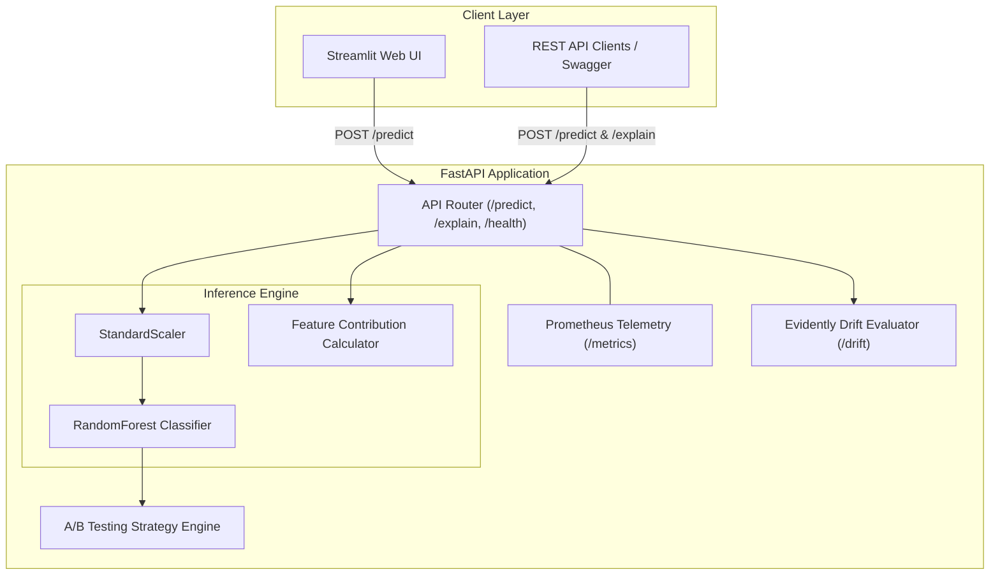

# Customer Churn Analytics Service

[](https://github.com/Baqir110/customer-churn-analytics/actions/workflows/ci.yml)

A production-grade machine learning microservice for customer churn prediction, automated risk triage, feature explainability, A/B testing strategy assignment, and data drift monitoring. Built using FastAPI, Scikit-Learn, Streamlit, and Evidently AI.

---

## Live Deployments

- **Interactive Web UI:** https://customer-churn-dashboard-1mrz.onrender.com
- **REST API Documentation:** https://customer-churn-api-ahwc.onrender.com/docs
- **Health Check Endpoint:** https://customer-churn-api-ahwc.onrender.com/api/v1/churn/health

---

## Overview

This service evaluates customer account metrics—such as tenure, billing amounts, and support tickets—to predict churn risk and generate automated retention actions.

### Key Capabilities

- **Inference Pipeline:** Serves real-time predictions for single inputs (`/predict`) or bulk payloads (`/predict/batch`).
- **Risk Triage Engine:** Automatically categorizes accounts into `CRITICAL`, `MODERATE`, or `LOW` risk tiers based on model probabilities.
- **A/B Testing Framework:** Routes high-risk accounts to targeted retention experiments using deterministic customer ID hashing.
- **Feature Importance:** Computes feature contribution scores (`/explain`) to identify the main drivers of customer churn.
- **Drift & Telemetry Monitoring:** Generates HTML dataset drift reports (`/drift`) using Evidently AI and exports Prometheus metrics (`/metrics`).

---

## System Architecture



---

## Technology Stack

| Component | Technology | Version |
| --- | --- | --- |
| **Language** | Python | 3.11+ / 3.13 |
| **Web Framework** | FastAPI, Uvicorn | 0.110+ |
| **Frontend UI** | Streamlit | 1.32+ |
| **Machine Learning** | Scikit-Learn, Pandas, NumPy | 1.4+ |
| **Model Monitoring** | Evidently AI | 0.4+ |
| **Telemetry & Testing** | Prometheus Instrumentator, Pytest | 8.1+ |
| **Containerization** | Docker, Docker Compose | - |
| **CI/CD** | GitHub Actions, Render | - |

---

## Repository Structure

```text
customer-churn-analytics/
├── .github/
│   └── workflows/
│       └── ci.yml              # CI/CD pipeline configuration
├── app/
│   ├── main.py                 # FastAPI application setup & Prometheus middleware
│   ├── api/
│   │   └── endpoints.py        # API routes (/predict, /explain, /predict/batch)
│   ├── core/
│   │   ├── config.py           # Application settings
│   │   └── logging.py          # Structured logging configuration
│   ├── ml/
│   │   ├── drift.py            # Evidently AI drift report service
│   │   ├── explain.py          # Feature contribution logic
│   │   ├── predict.py          # Model loading & inference wrapper
│   │   └── train.py            # Model training pipeline
│   ├── models/
│   │   └── schemas.py          # Pydantic data schemas
│   └── services/
│       └── strategy.py         # Business logic & A/B testing strategy engine
├── dashboard/
│   └── app.py                  # Streamlit UI dashboard
├── data/
│   ├── churn_data.csv          # Reference baseline dataset
│   └── churn_model.joblib      # Serialized ML model artifact
├── docker/
│   └── Dockerfile              # Docker container setup
├── tests/
│   ├── test_api.py             # API route integration tests
│   ├── test_main_and_drift.py  # System endpoints & drift report tests
│   ├── test_new_features.py    # Batch, explainability, & telemetry tests
│   ├── test_predict.py         # ML model unit tests
│   ├── test_strategy.py        # Business logic unit tests
│   └── test_train.py           # Training pipeline unit tests
├── docker-compose.yml
├── locustfile.py               # Load testing script
├── requirements.txt
└── README.md

```

---

## Getting Started

### Prerequisites

* Python 3.11+
* Git
* Docker (optional)

### Installation

1. **Clone the repository:**
```bash
git clone [https://github.com/Baqir110/customer-churn-analytics.git](https://github.com/Baqir110/customer-churn-analytics.git)
cd customer-churn-analytics

```


2. **Initialize virtual environment:**
```bash
python -m venv venv
source venv/bin/activate  # On Windows: venv\Scripts\activate

```


3. **Install dependencies:**
```bash
pip install --upgrade pip
pip install -r requirements.txt
pre-commit install

```


4. **Train the model:**
```bash
python -m app.ml.train

```


---

## Running the Application

### Local API Server

Start the application using Uvicorn:

```bash
python -m app.main

```

Access the interactive API documentation at `http://127.0.0.1:8000/docs`.

### Dashboard Interface

Launch the Streamlit web dashboard:

```bash
streamlit run dashboard/app.py

```

### Containerized Environment

Run the full application stack using Docker Compose:

```bash
docker compose up --build -d

```

* **API Service:** `http://localhost:8000`
* **Dashboard:** `http://localhost:8501`

---

## API Reference

### 1. Predict Churn Risk & A/B Strategy

```http
POST /api/v1/churn/predict

```

#### Request Body

```json
{
  "customer_id": "CUST-1001",
  "tenure_months": 2,
  "monthly_charges": 115.0,
  "total_charges": 230.0,
  "support_tickets": 7
}

```

#### Response Payload

```json
{
  "customer_id": "CUST-1001",
  "churn_prediction": 1,
  "churn_probability": 0.824,
  "risk_level": "CRITICAL",
  "retention_strategy": "Trigger priority outbound retention call and offer 20% renewal discount. Strategy: Variant_A_20_Percent_Discount",
  "ab_variant": "Variant_A_20_Percent_Discount"
}

```

### 2. Feature Importance Explanation

```http
POST /api/v1/churn/explain

```

#### Response Payload

```json
{
  "customer_id": "CUST-1001",
  "feature_contributions": {
    "tenure_months": -0.1852,
    "monthly_charges": 0.0821,
    "total_charges": -0.0412,
    "support_tickets": 0.3412
  }
}

```

### 3. Batch Prediction

```http
POST /api/v1/churn/predict/batch

```

Accepts an array of customer feature objects and returns batch prediction results.

---

## Testing & Quality Checks

Run the Pytest suite to measure code coverage:

```bash
python -m pytest --cov=app tests

```

### Coverage Overview (14 Passed Tests)

| Module | Statements | Missed | Coverage |
| --- | --- | --- | --- |
| `app/api/endpoints.py` | 46 | 11 | 76% |
| `app/ml/drift.py` | 42 | 3 | 93% |
| `app/ml/explain.py` | 11 | 0 | **100%** |
| `app/ml/predict.py` | 26 | 3 | 88% |
| `app/ml/train.py` | 33 | 1 | 97% |
| `app/services/strategy.py` | 12 | 0 | **100%** |
| **TOTAL** | **235** | **22** | **91%** |

---

## Performance Benchmarks

Locust load testing was executed against the FastAPI prediction endpoint under concurrent load.

| Metric | Result |
| --- | --- |
| **Total Requests Processed** | 2,300+ |
| **Failure Rate** | 0.0% |
| **Throughput (RPS)** | ~39.4 req/sec |
| **Median Response Time** | 28 ms |
| **95th Percentile Latency** | 94 ms |

---

## Roadmap

* [x] Deploy live backend microservice and interactive UI frontend to Render.
* [x] Instrument `/metrics` endpoint with Prometheus FastAPI Instrumentator.
* [x] Add feature importance endpoint (`/explain`).
* [x] Support batch prediction (`/predict/batch`).
* [x] Integrate A/B testing framework for retention strategy assignment.

---

## License

Distributed under the MIT License.
